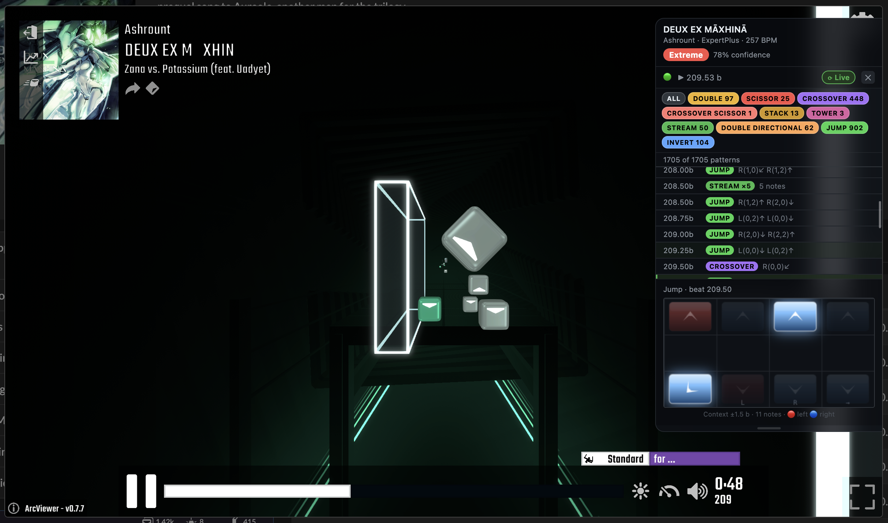

# Beat Saber Map Classifier

ML classifier for Beat Saber custom maps into 5 categories: **Tech**, **Speed**, **Accuracy**, **Standard**, **Extreme**.

The primary signal comes from note-level pattern features extracted directly from `.dat` map files — what a player actually has to hit, not summary metadata. The best models (Optuna-tuned XGBoost and LightGBM on merged features) reach **87.97% CV F1**. A self-contained pattern-only classifier is exported to ONNX for use in JavaScript environments.

## Categories

| Category | Characteristics |
|----------|----------------|
| **Tech** | Complex patterns, crossovers, high wall count, parity resets |
| **Speed** | High NPS/eBPM, linear swings, fast streams |
| **Accuracy** | Precision-focused, high rbRatio, arc-heavy |
| **Standard** | Balanced, conventional mapping |
| **Extreme** | Highest difficulty across all metrics — high NPS + complexity |

## Dataset & limitations

The model is trained exclusively on maps from the **BSWC (Beat Saber World Cup) pooling database** — a curated set of competitive maps maintained by the BSWC map poolers. This has two implications:

- **Subjectivity**: the category labels reflect the poolers' judgement. Reasonable people can disagree on where a map falls, and the model inherits that subjectivity.
- **Coverage**: the model has only seen ~500 maps out of hundreds of thousands on BeatSaver. Unusual or niche mapping styles that aren't represented in competitive pools may be misclassified.

The pooling database is closed but publicly accessible. Map poolers actively maintain it, and **[suggestions for new maps can be submitted](https://cube.community/pooling/suggestion)** — accepted maps may be included in the dataset for future training runs.

## Using the classifier

```bash
npm install bs-map-classifier onnxruntime-web
```

> **Note:** `onnxruntime-web` (WASM) works in Node.js and browsers alike. `onnxruntime-node` uses a native `.node` addon and will fail in environments where native addons are disabled (sandboxed runtimes, some CI setups, Deno, etc.) — prefer `onnxruntime-web` unless you have a specific reason to use the native runtime.

```js
import { loadEmbeddedClassifier } from 'bs-map-classifier/embedded';
import { parseBeatmap, findDatFilename, parseMap } from 'bs-map-classifier';
import { readFile } from 'node:fs/promises';

const clf     = await loadEmbeddedClassifier();
const infoDat = JSON.parse(await readFile('Info.dat', 'utf8'));
const datJson = JSON.parse(await readFile(findDatFilename(infoDat, 'Standard', 'ExpertPlus'), 'utf8'));
const result  = await parseMap(parseBeatmap(datJson), /* bpm */ 180, clf);

console.log(result.classification.category);    // 'Tech'
console.log(result.classification.confidence);  // 0.87
console.log(result.patterns.length + ' patterns detected');
```

Try it instantly in your browser: **[Open in StackBlitz](https://stackblitz.com/edit/node-kehuegda?file=index.js)** · **[Web demo](https://jiveoff.github.io/bs-map-classifier/)**

See [`js/lib/README.md`](js/lib/README.md) for the full API — browser usage, custom model paths, `annotatePatterns`, TypeScript types, CJS usage, and a complete BeatSaver fetch example.

### Explore the outputs

| Resource | Description |
|---|---|
| [`models/onnx/`](https://github.com/JiveOff/bs-map-classifier/tree/main/models/onnx) | Trained ONNX models + meta JSON (pattern-only, gradient boosting, random forest) |
| [`data/processed/feature_stats_by_category.json`](https://github.com/JiveOff/bs-map-classifier/blob/main/data/processed/feature_stats_by_category.json) | Per-category feature statistics (mean, std, min, max) |
| [`docs/RESULTS.md`](https://github.com/JiveOff/bs-map-classifier/blob/main/docs/RESULTS.md) | Full model results with per-class breakdowns |
| [`docs/PATTERNS.md`](https://github.com/JiveOff/bs-map-classifier/blob/main/docs/PATTERNS.md) | Pattern type reference with images |

---

## Using the overlay

`bs-pattern-overlay` is a browser extension and userscript that runs on top of Beat Saber map viewers. It auto-detects the current map, downloads the zip from BeatSaver, and overlays a scrollable pattern timeline synced to playback — powered by the same classifier.



### Browser extension

Install from the [latest release](https://github.com/JiveOff/bs-map-classifier/releases/latest) — grab `bs-pattern-overlay-vX.X.X.zip`, unzip it, then load it as an unpacked extension in Chrome (`chrome://extensions` → Load unpacked) or Firefox.

Works on [ArcViewer](https://allpoland.github.io/ArcViewer/), [BeatSaver](https://beatsaver.com) map pages, and ScoreSaber.

### Userscript

Install via [Tampermonkey](https://www.tampermonkey.net/) or [Violentmonkey](https://violentmonkey.github.io/) — click **[Install userscript](https://github.com/JiveOff/bs-map-classifier/releases/latest/download/bs-pattern-overlay.user.js)**. Same sites as the extension; no browser extension store required.

---

## Python pipeline setup

```bash
python3 -m venv .venv
source .venv/bin/activate
pip install -r requirements.txt
brew install libomp  # macOS only, required for XGBoost
```

---

## Full Pipeline

### Step 1 — Metadata features

Extract numeric features from the `analysisMetadata` JSON embedded in the source CSV. Produces ~72 features per map (NPS, SPS, NJS, parity stats, eBPM, etc.).

```bash
python src/data/features_v2.py \
  --csv dataset_wc_pooling.csv \
  --output data/processed/features.csv
```

Output: `data/processed/features.csv` (502 maps × 72 features)

---

### Step 2 — Download map zips

Download the actual `.zip` files from the BeatSaver API and extract them. Each map lands at `data/raw/maps/<category>/<key>/` with two sidecar files: `_beatsaver.json` (full API response) and `_dataset.json` (difficulty/characteristic/BPM needed by the parser).

```bash
python src/data/downloader.py \
  --csv dataset_wc_pooling.csv \
  --output data/raw/maps

# Options:
# --limit 50          download first N maps only
# --category Speed    download a single category
```

Output: `data/raw/maps/<category>/<key>/*.dat` + sidecars

---

### Step 3 — Pattern features

Parse the labelled difficulty's `.dat` file for each map and extract note-level features. Handles beatmap formats v2, v3, and v4.

```bash
python src/data/map_parser.py \
  --maps data/raw/maps \
  --output data/processed/pattern_features.csv
```

Output: `data/processed/pattern_features.csv` (493 maps × 202 features)

**Feature groups:**
- Lane/layer histograms, direction histograms, hand balance
- eBPM per hand (mean/median/max/p90), timing variability, rotation
- Arc and chain rates, wall density
- 39 named pattern counts + rates (streams, crossovers, doubles, DDs, scissors, towers, loloppes, hooks, bomb resets, etc.)
- 72 windowed features: 16-beat window aggregates (max/mean/std/p90/p10/peak\_ratio) for note density, crossover rate, eBPM, stream rate, and more

---

### Step 4 — Merge features

Join metadata features and pattern features on the map key to produce the full training set.

```python
import pandas as pd

meta    = pd.read_csv('data/processed/features.csv')
pattern = pd.read_csv('data/processed/pattern_features.csv')
merged  = meta.merge(pattern, left_on='key', right_on='map_key', suffixes=('', '_pat'))
merged.to_csv('data/processed/features_merged.csv', index=False)
```

Output: `data/processed/features_merged.csv` (473 maps × 274 columns, 263 numeric after dropping ID columns)

---

### Step 5 — Baseline training

Train 7 models (Logistic Regression, Random Forest, XGBoost, LightGBM, Decision Tree, SVM, KNN) with median imputation + standard scaling. Results saved as `.pkl` + `_metrics.json`.

```bash
# On merged features (recommended)
python src/models/baseline.py \
  --features data/processed/features_merged.csv \
  --output models/baseline_models \
  --cross_validate

# On metadata only (faster, lower ceiling)
python src/models/baseline.py \
  --features data/processed/features.csv \
  --output models/baseline_models \
  --cross_validate
```

Output: `models/baseline_models/<model>.pkl` + `<model>_metrics.json`

---

### Step 6 — Hyperparameter tuning

Run Optuna Bayesian optimisation (TPE sampler, 150 trials each) over XGBoost, LightGBM, GradientBoosting, and RandomForest. Objective: 5-fold CV F1 (weighted).

```bash
python src/models/tune.py \
  --features data/processed/features_merged.csv \
  --trials 150

# Subset of models only:
python src/models/tune.py --models xgboost lgbm
```

Output: `models/tuned/<model>.pkl` + `<model>_result.json`

| Model | CV F1 | Test Acc | Test F1 |
|-------|-------|----------|---------|
| **Random Forest** | **88.54%** | **82.11%** | **81.68%** |
| XGBoost | 87.97% | 81.05% | 80.84% |
| LightGBM | 87.97% | 81.05% | 80.92% |
| Gradient Boosting | 87.40% | 82.11% | 81.61% |

---

### Step 7 — ONNX export

Export models to ONNX with full preprocessing params embedded in a `*_meta.json` sidecar. Any runtime (Python, JavaScript, etc.) can reproduce the sklearn pipeline without sklearn.

```bash
python src/models/export_onnx.py
```

Three models are exported:

| File | Source | Features | Use case |
|------|--------|----------|----------|
| `gradient_boosting.onnx` | Tuned GB from `models/tuned/` | 263 merged | Best accuracy |
| `random_forest.onnx` | Tuned RF from `models/tuned/` | 263 merged | Best CV F1 (88.54%) |
| `pattern_classifier.onnx` | Fresh GB trained here | 202 pattern-only | JS/browser — no metadata API needed |

Each ONNX file ships with a `*_meta.json` containing:
- `features` — ordered feature name list
- `classes` — class label order
- `imputer_medians` — per-feature median for NaN imputation
- `scaler_mean` / `scaler_scale` — StandardScaler parameters

Output: `models/onnx/*.onnx` + `models/onnx/*_meta.json`

---

## Project Structure

```
src/
  data/
    features_v2.py             # Step 1 — metadata feature extraction
    downloader.py              # Step 2 — BeatSaver map downloader
    map_parser.py              # Step 3 — .dat parser → 202 pattern features
    pattern_annotator.py       # per-note pattern labelling (used by map_parser)
  models/
    baseline.py                # Step 5 — train + evaluate 7 baseline models
    tune.py                    # Step 6 — Optuna hyperparameter tuning
    export_onnx.py             # Step 7 — export to ONNX
data/
  raw/maps/                    # downloaded + extracted map zips (gitignored)
  processed/
    feature_stats_by_category.json  # per-category feature statistics
models/
  baseline_models/             # _metrics.json per model (+ .pkl, gitignored)
  tuned/                       # Optuna result JSON per model (+ .pkl, gitignored)
  onnx/                        # .onnx + _meta.json (3 exported models)
js/
  lib/                         # bs-map-classifier npm package
    src/                       #   ESM source (parser, features, classify, patterns)
    models/                    #   pattern_classifier.onnx + _meta.json
    dist/                      #   CJS bundle + embedded.mjs (model baked in as base64)
    types/                     #   TypeScript definitions
  extension/                   # bs-pattern-overlay browser extension + userscript
    src/                       #   content script + entry points
    public/                    #   manifest.json, popup.html, injected.js
notebooks/
  test_classifier.ipynb        # classify any BeatSaver map interactively
docs/
  RESULTS.md                   # detailed results and per-class breakdowns
  PATTERNS.md                  # pattern type reference
  patterns/                    # reference images per pattern type
wiki/                          # BSMG wiki submodule (map format docs)
```

## Results summary

Full progression from metadata-only to the final tuned models:

| Stage | CV F1 |
|-------|-------|
| Metadata only (XGBoost baseline) | 64.3% |
| + 93 pattern features | 86.5% |
| + 39 pattern types (130 features) | 84.6%* |
| + 72 windowed/temporal features | 84.6% |
| Optuna-tuned XGBoost / LightGBM | **87.97%** |

*untuned; GradientBoosting degrades at high dimensionality without tuning.

See [`docs/RESULTS.md`](docs/RESULTS.md) for full per-class breakdowns and finding notes.

## Acknowledgements

- [BSWC Pooling Team](https://cube.community/pooling) — initial dataset of categorised maps used for training
- [BSMG Wiki](https://bsmg.wiki/) — mapping format documentation
- [BeatSaver](https://beatsaver.com/) — map data and API
